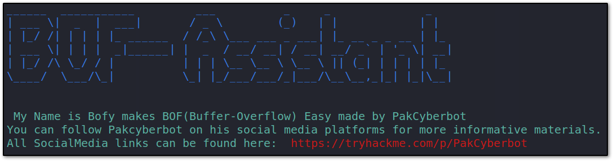
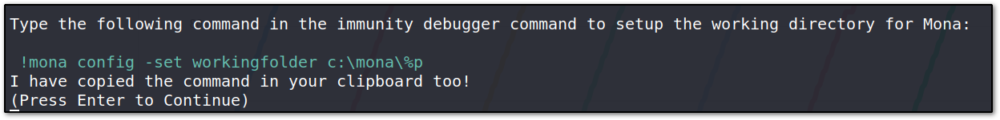
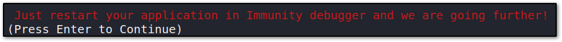
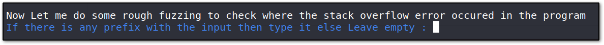
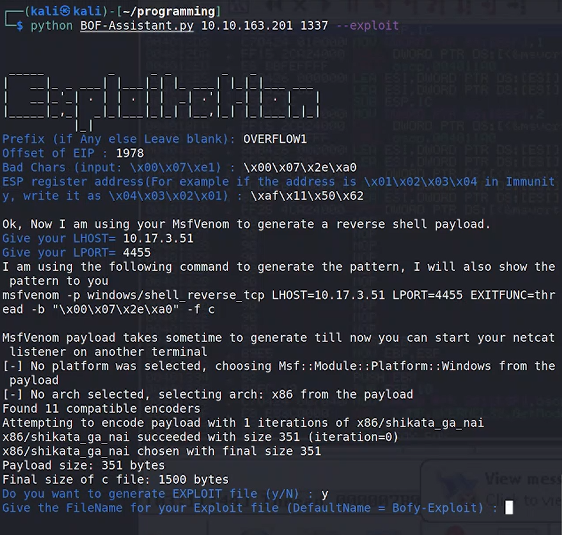
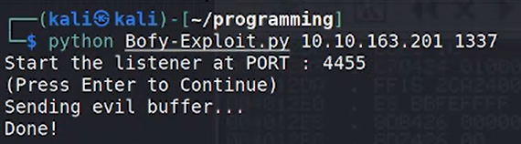
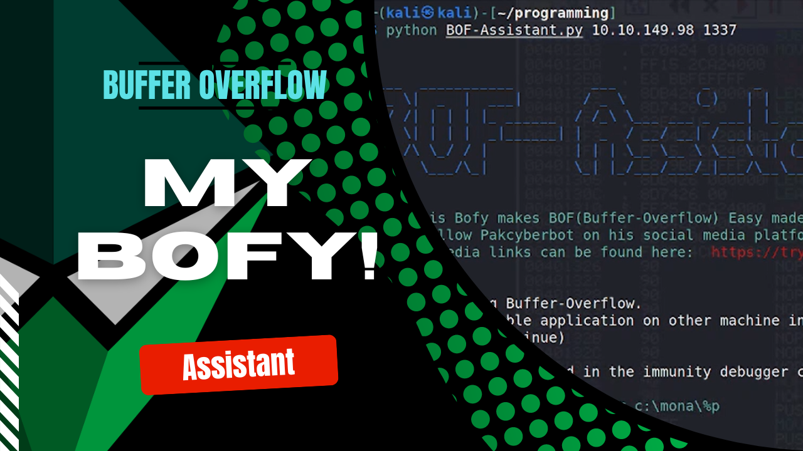

# Buffer-Overflow(BOF)-Assitant
This program is not fully automated. It's just the helper during stack-based buffer-overflow exploitation.


- It can automatically copy Mona commands in your clipboard to directly paste in Immunity Debugger

- It can use your bash shell to generate payloads from **Metasploit**
- It also informs you about each stage of Buffer-Overflow Exploitation
- This program has different text colors for different function.
- - Restart Vulnerable Application : Red


- - Taking User Input : Blue


- - Text that automatically copied to your Clipboard : Green


- You can directly do exploitation of the target program using -e/--exploit flag, if you know EIP offset, Bad Chars, and Jump point.


- You can generate the portable exploit python program too to directly exploit the target without providing any values.


### Complete the requirements for this program 
```
pip install -r requirements.txt
```
### Start your BOF-Assistant
```
python3 BOF-Assistant.py <IP> <Port>
```
## For Explanation:


- You can check out my **Article** on how I created this program: [Code Explanation](https://pakcyberbot.medium.com/automation-of-buffer-overflow-b7252d77e72e)
- You can check out my demonstration **Video** of this program: [Demonstration of the Program](https://youtu.be/3nSAHeJ2YpQ)

### Note:
This project is for educational purposes. I didn't explain the stack-based buffer-overflow, you can learn it from the below links.

## Credits

You can learn Buffer-Overflow from TryHackMe room created by @Tib3rius: https://tryhackme.com/room/bufferoverflowprep

This Repository created by @Tib3rius helped me to create this Assistant: https://github.com/Tib3rius/Pentest-Cheatsheets/blob/master/exploits/buffer-overflows.rst

**You can follow me on:**

- YouTube: [https://youtube.com/@PakCyberbot](https://youtube.com/@pakcyberbot)
- Twitter: [https://twitter.com/PakCyberbot](https://twitter.com/PakCyberbot)
- LinkedIn: [https://www.linkedin.com/in/pakcyberbot/](https://www.linkedin.com/in/pakcyberbot/)
- Medium: [https://pakcyberbot.medium.com/](https://pakcyberbot.medium.com/)
- Instagram: [https://www.instagram.com/pakcyberbot/](https://www.instagram.com/pakcyberbot/)
